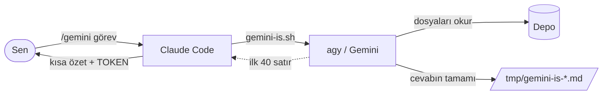
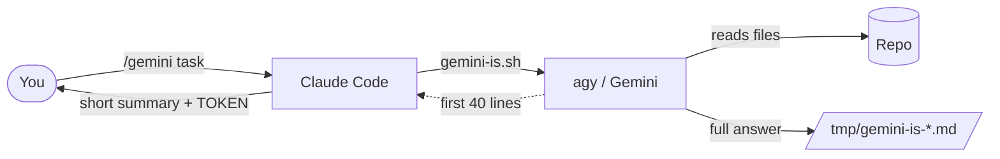

<div align="center">

# gemini-delegation-for-claude-code

**Claude Code'dan Gemini'ye iş devri — sarmalayıcı betik, sıkılaştırılmış izin modeli, ölçülmüş tasarruf.**

[](TEST_RESULTS.md)
[](TEST_RESULTS.md)
[](https://antigravity.google/docs/cli/install/)
[](LICENSE)

**[Türkçe](#türkçe)** · **[English](#english-version)**

</div>

---

## Quick start

```bash
# 1. Antigravity CLI
curl -fsSL https://antigravity.google/cli/install.sh | bash
~/.local/bin/agy --version

# 2. Bu depo
git clone <repo-url> ~/projeler/gemini-delegation-for-claude-code
cd ~/projeler/gemini-delegation-for-claude-code
chmod +x bin/gemini-is.sh

# 3. İzinler — örneği kopyala, yolları kendi depolarına göre düzelt
cp agy/settings.ornek.json agy/settings.json
$EDITOR agy/settings.json
ln -s "$PWD/agy/settings.json" ~/.gemini/antigravity-cli/settings.json

# 4. Slash komutu
cp claude/command-gemini.ornek.md claude/command-gemini.md
$EDITOR claude/command-gemini.md     # yolları düzelt
ln -s "$PWD/claude/command-gemini.md" ~/.claude/commands/gemini.md

# 5. Claude'a betiği çalıştırma izni ver (~/.claude/settings.json)
#    "permissions": { "allow": ["Bash(~/projeler/gemini-delegation-for-claude-code/bin/gemini-is.sh:*)"] }

# 6. Test et
./bin/gemini-is.sh ~/bir/depo "Tek cumleyle: HTTP 301 ile 302 farki nedir?"
```

Çalıştı mı? `TOKEN ... | SURE ... | DURUM SUCCESS` satırını görmelisin. Detay için
[Derinlemesine kurulum](#derinlemesine-kurulum).

---

# Türkçe

## Ne işe yarar

Büyük dosya taramak, uzun log okumak, tekrarlı kod üretmek — bunlar Claude'un
bağlam penceresini yer ama derin düşünme istemez. Bu kurulum o işleri Gemini'ye
(Antigravity CLI) devreder.

Kazanç tek cümlede: **Gemini'nin okuduğu ham içerik Claude'un bağlamına hiç
girmez.** Claude'a yalnız bitmiş cevap döner.

Ölçüldü: 164 KB'lik bir sunucu dosyasında uç sayımı. Claude okusa ~41.000
token'lık bağlam yükü; Gemini'ye devredilince Claude'a dönen ~15 token. Sayılar
ve yöntem [TEST_RESULTS.md](TEST_RESULTS.md) dosyasında.

## Nasıl çalışır



Betik her çağrıda şunu basar:

```
TOKEN 26024 | SURE 15s | TUR 1 | DURUM SUCCESS
REDDEDILEN: command          # yalnız bir eylem reddedildiyse
---
<cevabın ilk 40 satırı>
---
CEVAP: /tmp/gemini-is-<id>.md
HAM:   /tmp/gemini-is-<id>.json
```

`REDDEDILEN` satırı `agy`'nin JSON çıktısındaki `denied_actions` alanından gelir
— modelin kendi beyanından değil. Bu fark önemli: ölçümde model var olmayan bir
dosya için "çalıştı" dedi. Tek güvenilir arıza sinyali bu satır.

## Ne zaman devret

Eşik "dosya büyük" değil. Üç soru, ilk **hayır**'da devretme:

1. İçerik gerçekten gerekli mi, yoksa `git grep` çıktısı yetiyor mu?
2. İçerik tek okumaya sığmıyor mu (dosya ~25.000 token üstü)?
3. Cevap kısa mı olacak — liste, tablo, birkaç madde?

| Devret | Devretme |
|---|---|
| 25k token üstü dosyanın içeriği | `git grep` ile biten sorular |
| Uzun log, stack trace, JSON dökümü | Tek küçük dosya, 500 satır altı iş |
| Çok dosyalı içerik çapraz taraması | Zaten okunmuş içerik |
| Şablona göre boilerplate | Mimari, güvenlik, şema, ödeme kararları |
| Uzun doküman özeti | İnternet gerektiren araştırma |
| Kavram anlatımı, ikinci görüş | Uzak makine komutu (`ssh` izinli değil) |

Alan bağımsız 25 maddelik tam katalog: **[claude/gorev-katalogu.md](claude/gorev-katalogu.md)**.
`CLAUDE.md`'ye doğrudan kopyalanabilir.

### Dürüst uyarı

Devir her zaman kazandırmaz. Ayrı bir ölçümde `git grep` ile tüm uçlar 8.982
token'a çıkarıldı; aynı iş Gemini'ye devredildiğinde Claude'a 4.397 token mal
oldu ama yalnız üçte biri kapsandı. Uç başına: Claude 125, Gemini 220 token.
Grep yetiyorsa devretme.

## Kullanım

```
/gemini <depo> içindeki SQL dosyalarını tara, kullanılmayan index'leri listele — en fazla 15 satır
/gemini şu kavramı açıkla: veritabanı bağlantı havuzu
/gemini <depo> için ikinci görüş: bu yaklaşımın açık noktaları neler
```

Sen yalnız işi yazarsın. Tam yolu eklemek, çıktı sınırı koymak, betiği çalıştırmak
ve `TOKEN` satırını aktarmak Claude'un işi.

**Claude devretmeyi kendisi başlatmaz.** Ama iş listesi çıkarırken Gemini'lik
maddeleri işaretler ve hazır komutu verir. Bu davranışı `~/.claude/CLAUDE.md`
dosyasına yazarsın; metin [aşağıda](#ana-sohbetin-çalışma-kuralı).

## Üç pratik kural

1. **Çıktı sınırını göreve yaz.** "en fazla 15 satır", "sadece `dosya:satır`".
   Sınır yoksa Gemini sayfalarca yazar ve kâr biter.
2. **Soruları tek çağrıda topla.** Her çağrı ayrı bir Claude turu.
3. **Devrettiğin kaynağı sonra tekrar okuma.** Maliyeti ikiye katlar.

---

## Derinlemesine kurulum

### İzin modeli

Headless modda (`agy -p`) onay penceresi yok. **Onay isteyen her araç sessizce
reddedilir:** çıkış kodu 0, `stdout` boş, `stderr`'e bir satır düşer:

```
jetski: no output produced — a tool required the "read_file" permission that
headless mode cannot prompt for, so it was auto-denied.
```

İzin kuralı yazılmadan repo okuma bile çalışmaz. Kurallar
`~/.gemini/antigravity-cli/settings.json` dosyasında:

```json
{
  "permissions": {
    "allow": [
      "read_file(/MUTLAK/YOL/depolar/*)",
      "command(git)",
      "command(ls)",
      "command(find)",
      "command(wc)"
    ],
    "deny": [
      "read_file(/MUTLAK/YOL/depolar/proje/.env.local)",
      "write_file(/MUTLAK/YOL/depolar/proje/.env.local)"
    ]
  }
}
```

Eylemler: `command(...)`, `read_file(...)`, `write_file(...)`, `read_url(...)`,
`execute_url(...)`, `mcp(...)`, `unsandboxed(...)`. Hedef literal, `regex:`
önekli ya da `*` olabilir.

**Komut eşleşmesi satırdaki her ikiliyi kapsar.** `git grep x | wc -l` için hem
`command(git)` hem `command(wc)` gerekir.

**Yazma ayrı bir kapı.** `write_file(...)` allow kuralı tek başına yetmez;
yazmayı açan `--mode accept-edits` bayrağıdır. Bayrak yalnız dosya
düzenlemelerini onaylar, komutlar yine allow listesinden geçer.
`--dangerously-skip-permissions` kullanma.

**Kabuk komutlarının çalışma klasörü repo değil.** `run_command`
`~/.gemini/antigravity-cli/scratch` altında çalışır. Göreli yol boş döner —
görev cümlesinde dosyaları tam yolla yaz.

### ⚠️ Ölçülen gerçek: `deny` sandığın kadar güçlü değil

| Ne | Sonuç |
|---|---|
| `deny` + tam yol + `read_file`/`write_file` | ✅ Çalışıyor |
| `deny` + regex + `read_file`/`write_file` | ❌ Çalışmıyor — `.env.local` yine açıldı |
| `deny` + `command(...)` | ❌ Çalışmıyor — `wc -l` deny'a rağmen çıktı verdi |
| İzinli komutun erişebildiği yol | ⚠️ Sınırsız — depo dışına da bakabiliyor |

**Koruma `deny`'dan değil, `allow` listesini dar tutmaktan gelir.** Bir ikili
izin listesindeyse her yola ulaşır. Dosya içeriği basabilen komutları listeye
koyma:

```
cat  head  tail  sed  awk  cut  sort  uniq  diff  grep  rg
```

Yerine: **dosya içeriği** → `read_file` aracı (deny orada tam yolla çalışıyor),
**arama** → `git grep` (yalnız takipli dosyalar, gitignore'lı `.env` hiç
girmez).

Gizli dosyalar `deny`'a **tam yolla** yazılır. Regex'e güvenme.

**Kalan açık:** izinli `wc` hâlâ depo dışına bakabiliyor ve satır sayısı
alabiliyor. İçerik basamıyor. Tam kapatmak `agy`'yi ayrı bir OS kullanıcısında
çalıştırmayı gerektirir — bu rehber onu kapsamıyor.

**Symlink şart.** İzin dosyasının iki kopyası bir kez ayrıştı ve aktif olanda
`deny` bloğu hiç yoktu. Depodaki dosyaya bakıp "korumalıyız" sanılıyordu.

### Sarmalayıcı betik

`agy` hiçbir yerden doğrudan çağrılmaz. Doğru çağrı üç şeyi birden gerektiriyor:
repo klasörüne geçmek, `--output-format json`, yazma işinde
`--mode accept-edits`. Modele hatırlatmak çalışmadı — ölçüldü: bayrak atlandı,
token raporu uyduruldu. Kalıp `bin/gemini-is.sh` içinde sabit.

```bash
./bin/gemini-is.sh <repo-yolu> "<görev>"
./bin/gemini-is.sh --yaz <repo-yolu> "<görev>"   # dosya değiştiren iş
```

Cevap `GEMINI_MAX_SATIR` satırında kesilir (varsayılan 40), tamamı `CEVAP`
dosyasına yazılır. Sebep: Claude'un bağlamına giren her şey sonraki her turda
yeniden gönderilir. `HAM` JSON'unu hiç açma — ölçüm için var.

Betiğin kaynağı `bin/gemini-is.sh`.

### Claude izinleri

`~/.claude/settings.json`:

```json
{
  "permissions": {
    "allow": ["Bash(~/projeler/gemini-delegation-for-claude-code/bin/gemini-is.sh:*)"]
  }
}
```

**İzin yalnız betiğe verilir, `agy`'ye değil.** `Bash(agy:*)` yazarsan model
betiği atlayıp doğrudan çağırabilir.

### Depo tarafı: `GEMINI.md`

`agy` çalıştığı klasörün kökündeki `GEMINI.md` dosyasını okur. Her depoya kısa
bir tane koy — 15-20 satır. Uzun olursa her çağrıda Gemini'nin kotasından yer.

İlk madde araç kuralı olmalı:

````markdown
## Araç kuralı — önce bunu oku
`grep`, `rg`, `cat`, `head`, `tail`, `sed`, `awk` KULLANMA — izin listesinde yok,
çağırırsan komut reddedilir ve iş yarıda kalır.
Dosya içeriği: `read_file`. Kod araması: `git grep`.
İzinli komutlar: ls, wc, find, git, pwd, echo, stat, tree, derleme/test.
Bir komut satırındaki HER ikili izinli olmalı.

## Ne olduğu
Dil, çatı, derleme. 4-6 satır dosya haritası.

## Sert kurallar
Dokunulmayacak dosyalar, adlandırma, değişmezler.

## Doğrulama
Derleme, tip denetimi, linter, test komutları.
````

Araç kuralı ilk madde çünkü ölçüldü: bu satır yokken Gemini refleksle `grep`
çağırdı ve iki koşuda 210.000 token harcayıp boş döndü.

### Ana sohbetin çalışma kuralı

Kurulumun son parçası. Olmadan sistem çalışır ama kullanılmaz — kimse hangi işin
Gemini'lik olduğunu hatırlamaz. `~/.claude/CLAUDE.md`:

````markdown
## Gemini devri — öner, kendin başlatma

**Gemini'yi kendiliğinden çalıştırma.** `gemini-is.sh` yalnız kullanıcı
`/gemini` yazdığında çalışır.

**Ama devredilecek işi ÖNERMEK senin işin.** Kullanıcı "şunları yapalım"
dediğinde, iş listesini çıkarırken her maddeyi üç soruyla süz:

1. İçerik gerçekten gerekli mi, yoksa `git grep` yetiyor mu?
2. İçerik tek okumaya sığmıyor mu (~25.000 token üstü)?
3. Cevap kısa mı olacak?

Üçüne de evet ise maddeyi Gemini'lik işaretle ve hazır komutu ver:

```
/gemini <tam yol ve iş>, <çıktı sınırı>
```

Komutu kendin çalıştırma — kullanıcı yapıştırsın. İlk soruya "hayır" çıkan
maddeyi kendin yap ve devretmeyi önerme. Mimari, güvenlik, şema, kimlik
doğrulama ve ödeme akışı kararları hiçbir koşulda önerilmez.

Gemini'lik maddeleri ayrı başlık altında topla.
````

Tek kullanıcıda birden çok depo varsa global dosya tercih et — depo başına
kopyalamak aynı kuralı her oturumda N kez ödemek demek.

### Alt ajan (isteğe bağlı)

Claude alt ajanı (`subagent`) ham çıktıyı kendi bağlamında tutar. **Varsayılan
yol bu değil:** alt ajan katmanı çağrı başına 20-45 bin Claude token'ı yiyor ve
normal işte kârın tamamından büyük. Yalnız ham çıktının 50 bin token'ı aşacağı
devasa taramada kullan.

Tanım: `claude/agent-gemini.ornek.md`.

## Sık karşılaşılanlar

| Belirti | Sebep |
|---|---|
| Boş cevap + `REDDEDILEN: command` | Gemini izinsiz komut çağırdı. En sık `grep`/`rg`/`cat` refleksi. `GEMINI.md`'ye araç kuralını yaz |
| Boş cevap + `REDDEDILEN: read_file` | Yol izin ağacının dışında. `allow` listesine bak |
| `agy: command not found` | PATH. Tam yol kullan ya da `agy install` |
| Komut boş dönüyor, hata yok | Göreli yol verilmiş. Tam yol yaz |
| Hiçbir dosya değişmedi | `--yaz` bayrağı eksik |
| Kota bitti | Abonelik sınırı. API anahtarına geç ya da işi böl |

## Başka makineye taşıma

1. `agy` kur ve giriş yap → `~/.local/bin/agy --version`
2. Depoyu klonla, `chmod +x bin/gemini-is.sh`
3. `agy/settings.ornek.json` → kopyala, yolları düzelt, symlink at
4. `claude/command-gemini.ornek.md` → kopyala, yolları düzelt, symlink at
5. `~/.claude/settings.json`'a betik izni
6. Her depoya `GEMINI.md` — araç kuralı ilk madde
7. `~/.claude/CLAUDE.md`'ye çalışma kuralı
8. Üç izin testini çalıştır:

```
Izin testi. <tam-yol> dosyasini read_file ile acmayi dene.
ICERIGINI ASLA YAZMA. Cevabin tek kelime olsun: ACIK veya KAPALI.
```

- Gizli dosya + `read_file` → `KAPALI` olmalı
- Gizli dosya + `cat` → `REDDEDILEN: command` olmalı
- Normal dosya + `git grep` → çalışmalı

Üçü de beklenen sonucu vermeden kurulum bitmiş sayılmaz.

## Neden MCP değil

`gemini-mcp-tool` gibi bir MCP sunucusu Gemini'yi adlandırılmış araç olarak
açar. Artısı yapılandırılmış arayüz. Eksisi: `agy`'nin üstüne üçüncü parti bir
katman, her oturumda bağlama yüklenen araç şemaları ve — asıl mesele — çıktının
tamamının Claude'un bağlamına düşmesi.

Doğrudan kabuk çağrısında çıktı dosyaya gider, yalnız gereken kısmı okunur.
Token biriktirmek amaçsa bu daha iyi.

## Bilinmesi gerekenler

**Gemini CLI tüketici hesapları için kapandı.** 18 Haziran 2026'dan beri "Login
with Google" yok; yerine Antigravity CLI (`agy`) geldi. Eski `gemini` komutunu
anlatan rehberler o tarihten öncesine ait.

**Kota abonelik katmanına bağlı.** Ücretsiz, AI Pro ve AI Ultra ile giriş
yapılıyor. AI Plus'ın kotası belgelenmemiş. Dar gelirse AI Studio'dan Gemini API
anahtarı al.

**Kim okursa token onun.** Claude dosyaları okuyup prompt'a gömerse bağlam
Claude tarafında harcanır ve devretmenin anlamı kalmaz. `agy` tam bir kod
ajanıdır: dosyayı kendisi bulur, kendisi okur. Ona yalnız görev cümlesi ve
klasör yolu verilir.

---

# English Version

**[⬆ Türkçe](#türkçe)**

## What this does

Scanning big files, reading long logs, generating repetitive code — these eat
Claude's context window without needing much reasoning. This setup hands them
off to Gemini (Antigravity CLI).

The win in one sentence: **the raw content Gemini reads never enters Claude's
context.** Only the finished answer comes back.

Measured: counting HTTP endpoints in a 164 KB server file. Claude reading it
costs ~41,000 tokens of context; delegated to Gemini, ~15 tokens come back.
Numbers and method in [TEST_RESULTS.md](TEST_RESULTS.md).

## How it works



Every call prints:

```
TOKEN 26024 | SURE 15s | TUR 1 | DURUM SUCCESS
REDDEDILEN: command          # only if an action was denied
---
<first 40 lines of the answer>
---
CEVAP: /tmp/gemini-is-<id>.md
HAM:   /tmp/gemini-is-<id>.json
```

The `REDDEDILEN` line comes from `agy`'s `denied_actions` JSON field — not from
what the model says. That distinction matters: in testing, the model claimed
"it worked" for a file that did not exist. This line is the only trustworthy
failure signal.

## When to delegate

The threshold isn't "the file is big." Three questions, stop at the first **no**:

1. Do you actually need the content, or does `git grep` output suffice?
2. Does the content exceed a single read (~25,000 tokens per file)?
3. Will the answer be short — a list, a table, a few bullets?

| Delegate | Don't delegate |
|---|---|
| Content of files over 25k tokens | Questions `git grep` answers |
| Long logs, stack traces, JSON dumps | One small file, work under 500 lines |
| Cross-file content scans | Content already read |
| Boilerplate from your template | Architecture, security, schema, payments |
| Long document summaries | Research needing the internet |
| Concept explanations, second opinions | Remote commands (`ssh` not allowed) |

Full domain-agnostic catalog, 25 items:
**[claude/gorev-katalogu.md](claude/gorev-katalogu.md)**. Copy straight into
your `CLAUDE.md`.

### Honest caveat

Delegation doesn't always win. In a separate measurement, `git grep` extracted
all endpoints for 8,982 tokens; the same job delegated cost Claude 4,397 tokens
but covered only a third. Per endpoint: Claude 125, Gemini 220. If grep is
enough, don't delegate.

## Usage

```
/gemini scan the SQL files in <repo>, list unused indexes — max 15 lines
/gemini explain this concept: database connection pooling
/gemini second opinion on <repo>: what are the weak points of this approach
```

You write the task. Adding the absolute path, setting the output limit, running
the script and reporting the `TOKEN` line is Claude's job.

**Claude never starts a delegation on its own.** But when it builds a task list,
it flags the Gemini-worthy items and hands you the ready command. You put that
behavior in `~/.claude/CLAUDE.md` — text [below](#main-session-rule).

## Three practical rules

1. **Put the output limit in the task.** "max 15 lines", "only `file:line`".
   Without a limit Gemini writes pages and the win evaporates.
2. **Batch questions into one call.** Each call is another Claude turn.
3. **Don't re-read what you delegated.** It doubles the cost.

---

## Deep dive

### Permission model

In headless mode (`agy -p`) there is no approval prompt. **Any tool that would
ask for approval is silently denied:** exit code 0, empty `stdout`, one line on
`stderr`:

```
jetski: no output produced — a tool required the "read_file" permission that
headless mode cannot prompt for, so it was auto-denied.
```

Without permission rules even reading the repo fails. Rules live in
`~/.gemini/antigravity-cli/settings.json`:

```json
{
  "permissions": {
    "allow": [
      "read_file(/ABS/PATH/repos/*)",
      "command(git)",
      "command(ls)",
      "command(find)",
      "command(wc)"
    ],
    "deny": [
      "read_file(/ABS/PATH/repos/project/.env.local)",
      "write_file(/ABS/PATH/repos/project/.env.local)"
    ]
  }
}
```

Actions: `command(...)`, `read_file(...)`, `write_file(...)`, `read_url(...)`,
`execute_url(...)`, `mcp(...)`, `unsandboxed(...)`. Targets can be literal,
`regex:`-prefixed, or `*`.

**Command matching covers every binary on the line.** `git grep x | wc -l` needs
both `command(git)` and `command(wc)`.

**Writing is a separate gate.** A `write_file(...)` allow rule alone is not
enough; `--mode accept-edits` is what opens it. That flag auto-approves file
edits only — commands still go through the allow list. Never use
`--dangerously-skip-permissions`.

**Shell commands don't run in your repo.** `run_command` executes under
`~/.gemini/antigravity-cli/scratch`. Relative paths return nothing — always write
absolute paths in the task.

### ⚠️ Measured reality: `deny` is weaker than it looks

| What | Result |
|---|---|
| `deny` + absolute path + `read_file`/`write_file` | ✅ Works |
| `deny` + regex + `read_file`/`write_file` | ❌ Doesn't work — `.env.local` still opened |
| `deny` + `command(...)` | ❌ Doesn't work — `wc -l` returned output anyway |
| Paths an allowed command can reach | ⚠️ Unlimited — including outside the repo |

**Protection comes from a narrow `allow` list, not from `deny`.** If a binary is
allowed, it reaches every path. Keep content-dumping commands off the list:

```
cat  head  tail  sed  awk  cut  sort  uniq  diff  grep  rg
```

Instead: **file content** → the `read_file` tool (deny works there with absolute
paths), **search** → `git grep` (tracked files only, so gitignored `.env` never
enters the search).

List secret files in `deny` with **absolute paths**. Don't trust regex.

**Remaining hole:** an allowed `wc` can still reach outside the repo and read
metadata like line counts. It cannot dump content. Closing this fully means
running `agy` under a separate OS user — out of scope here.

**Use a symlink.** Two copies of the permission file drifted apart once, and the
active one had no `deny` block at all. Looking at the repo copy gave false
confidence.

### The wrapper script

`agy` is never called directly. A correct call needs three things at once: the
repo directory, `--output-format json`, and `--mode accept-edits` for writes.
Reminding the model didn't work — measured: flags skipped, token numbers made
up. The pattern is fixed in `bin/gemini-is.sh`.

```bash
./bin/gemini-is.sh <repo-path> "<task>"
./bin/gemini-is.sh --yaz <repo-path> "<task>"   # write-enabled
```

The answer is cut at `GEMINI_MAX_SATIR` lines (default 40); the full text goes
to the `CEVAP` file. Reason: anything that enters Claude's context is resent on
every later turn. Never open the `HAM` JSON — it exists for measurement.

Source: `bin/gemini-is.sh`.

### Claude permissions

`~/.claude/settings.json`:

```json
{
  "permissions": {
    "allow": ["Bash(~/projects/gemini-delegation-for-claude-code/bin/gemini-is.sh:*)"]
  }
}
```

**Grant permission to the script only, never to `agy`.** With `Bash(agy:*)` the
model can bypass the script and call it directly.

### Repo side: `GEMINI.md`

`agy` reads `GEMINI.md` from the root of whatever directory it runs in. Put a
short one in every repo — 15-20 lines. Longer files eat Gemini's quota on every
call.

The tool rule goes first:

````markdown
## Tool rule — read this first
Do NOT use `grep`, `rg`, `cat`, `head`, `tail`, `sed`, `awk` — they are not on
the allow list; calling one gets denied and the task aborts.
File content: `read_file`. Code search: `git grep`.
Allowed commands: ls, wc, find, git, pwd, echo, stat, tree, build/test.
EVERY binary on a command line must be allowed.

## What this is
Language, framework, build. A 4-6 line file map.

## Hard rules
Files not to touch, naming, invariants.

## Verification
Build, typecheck, lint, test commands.
````

The tool rule is first because it was measured: without that line Gemini reached
for `grep` by reflex and burned 210,000 tokens across two runs for nothing.

### Main session rule

The last piece. Without it the setup works but goes unused — nobody remembers
which task is worth delegating. Put this in `~/.claude/CLAUDE.md`:

````markdown
## Gemini delegation — suggest, never start it yourself

**Never run Gemini on your own.** `gemini-is.sh` runs only when the user types
`/gemini`.

**But flagging delegable work is your job.** When the user asks what to do next,
filter every item through three questions:

1. Is the content actually needed, or does `git grep` suffice?
2. Does the content exceed a single read (~25,000 tokens)?
3. Will the answer be short?

If all three are yes, flag the item and hand over the ready command:

```
/gemini <absolute path and task>, <output limit>
```

Don't run it yourself — the user pastes it. Items that fail the first question
you do yourself, without suggesting delegation. Architecture, security, schema
design, authentication and payment flows are never suggested.

Group the delegable items under their own heading.
````

With more than one repo, prefer the global file — copying the same rule per repo
means paying for it N times every session.

### Subagent (optional)

A Claude subagent keeps raw output inside its own context. **This is not the
default path:** the subagent layer costs 20-45k Claude tokens per call, more
than the entire win on normal work. Use it only when raw output would exceed
50k tokens.

Definition: `claude/agent-gemini.ornek.md`.

## Troubleshooting

| Symptom | Cause |
|---|---|
| Empty answer + `REDDEDILEN: command` | Gemini called a disallowed command, usually `grep`/`rg`/`cat` by reflex. Add the tool rule to `GEMINI.md` |
| Empty answer + `REDDEDILEN: read_file` | Path is outside the allowed tree. Check the `allow` list |
| `agy: command not found` | PATH. Use the full path or run `agy install` |
| Command returns nothing, no error | Relative path was used. Write absolute paths |
| No files changed | The `--yaz` flag is missing |
| Quota exhausted | Subscription limit. Switch to an API key or split the job |

## Porting to another machine

1. Install `agy`, sign in → `~/.local/bin/agy --version`
2. Clone the repo, `chmod +x bin/gemini-is.sh`
3. Copy `agy/settings.ornek.json`, fix paths, symlink it
4. Copy `claude/command-gemini.ornek.md`, fix paths, symlink it
5. Add the script permission to `~/.claude/settings.json`
6. Put `GEMINI.md` in every repo — tool rule first
7. Add the working rule to `~/.claude/CLAUDE.md`
8. Run the three permission tests:

```
Permission test. Try to open <absolute-path> with read_file.
NEVER print the contents. Answer with one word: OPEN or CLOSED.
```

- Secret file + `read_file` → must be `CLOSED`
- Secret file + `cat` → must print `REDDEDILEN: command`
- Normal file + `git grep` → must work

The setup isn't done until all three behave as expected.

## Why not MCP

An MCP server like `gemini-mcp-tool` exposes Gemini as a named tool. Upside: a
structured interface. Downside: a third-party layer on top of `agy`, tool
schemas loaded into context every session, and — the real problem — the entire
output landing in Claude's context.

With a direct shell call the output goes to a file and you read only what you
need. If the goal is saving tokens, this wins.

## Things to know

**Gemini CLI is closed to consumer accounts.** Since 18 June 2026 there is no
"Login with Google"; Antigravity CLI (`agy`) replaced it. Guides that describe
the old `gemini` command predate that.

**Quota depends on your subscription tier.** Free, AI Pro and AI Ultra can sign
in. AI Plus quota is undocumented. If it's too tight, get a Gemini API key from
AI Studio.

**Whoever reads, pays.** If Claude reads the files and embeds them in the
prompt, the context is spent on Claude's side and delegation is pointless. `agy`
is a full coding agent: it finds and reads files itself. Give it the task
sentence and a directory path, nothing else.

---

## Repository contents

| File | What it's for |
|---|---|
| `README.md` | This guide |
| [`TEST_RESULTS.md`](TEST_RESULTS.md) | Measured permission and savings tests |
| `bin/gemini-is.sh` | Wrapper script — every call goes through it |
| `agy/settings.ornek.json` | Permission file template |
| `claude/command-gemini.ornek.md` | The `/gemini` slash command |
| `claude/agent-gemini.ornek.md` | Subagent definition (optional) |
| [`claude/gorev-katalogu.md`](claude/gorev-katalogu.md) | 25-item delegation catalog |
| `claude/README.md` | Claude-side setup steps |

## Links

- [Antigravity CLI install](https://antigravity.google/docs/cli/install/)
- [Headless mode](https://antigravity.google/docs/cli/headless/)
- [Permission syntax](https://antigravity.google/docs/permissions?tab=cli)
- [Best practices](https://antigravity.google/docs/cli/best-practices/)

## License

MIT — see [LICENSE](LICENSE).
